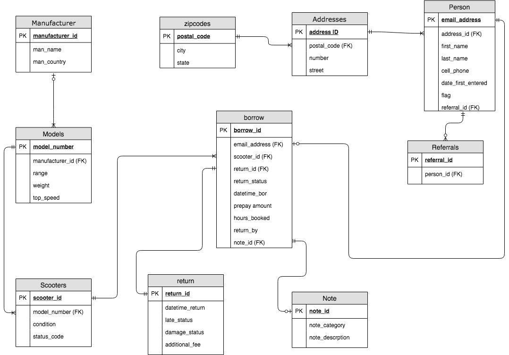

# Homework 05

## Scoot-Share

* TODO: a list of design decisions
	* Used more of a dimensional modeling and star schema type approach
	* Seperate manufacturer, models, and scooter to help normalize 
	* Also seperate out address as multiple customers can come from the same address
	* further normalize through postal code to avoid repitition of city and state
	* connected these to the person table, which holds all the information about the customer
	* admittedly we could have possibly normalized further by seperating a customer from a person
	* take care of referrals in a seperate table (could have also done a circular relationship)
	* the borrow is the "fact" table which takes care of the initial information before the customer actually takes a scooter
	* also have a one-to-one return table that takes care of the aftermath info (i.e. damages and late fees)
	* also have a notes table also connecting to a borrow
* TODO: a list of assumptions
	* flag is just a boolean value
	* payment can be ignored since it is taken care of by a third-party
	* model number and email address must be unique no matter what

Scripts

* [part-1-scoot-share-create.sql](part-1-scoot-share-create.sql)
* [part-1-scoot-share-queries.sql](part-1-scoot-share-queries.sql)

## Normalization

* [part-2-normalization-create.sql](part-2-normalization-create.sql)
* [part-2-normalization-import.sql](part-2-normalization-import.sql)
* [part-2-normalization-queries.sql](part-2-normalization-queries.sql)
